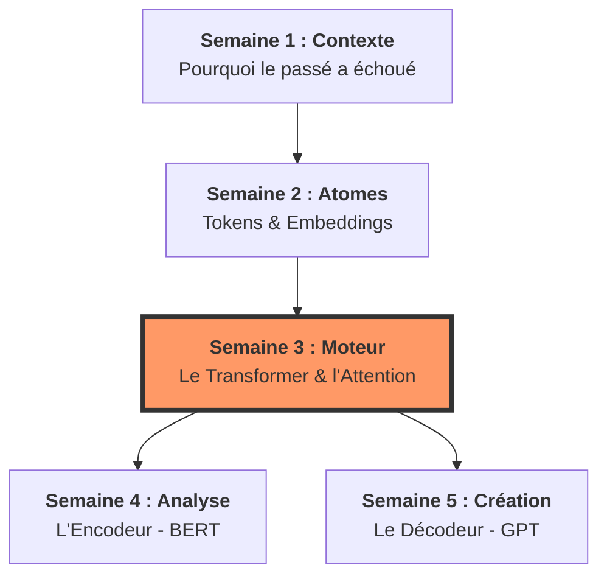

# 🏗️ Chapitre 1 : L'Architecture de l'Intelligence
## Comprendre le moteur sémantique (Semaines 1 à 5)

Bonjour à toutes et à tous ! Nous ouvrons aujourd'hui le premier grand livre de notre cursus. Avant de demander à une IA de révolutionner votre entreprise ou de coder vos logiciels, vous devez comprendre la nature même de sa "pensée". 

Dans ce chapitre, nous allons voyager au cœur du silicium pour comprendre comment un simple courant électrique finit par porter le poids du langage humain. 

> [!IMPORTANT]
‼️ **Je dois insister :** les cinq premières semaines ne sont pas une introduction, elles sont le **code source** de votre expertise. Si vous comprenez le Chapitre 1, rien ne vous sera impossible dans le reste du semestre. Bienvenue dans l'ingénierie du sens !

---
## 🗺️ Structure du Chapitre : La montée en puissance
Ce premier chapitre est conçu comme une ascension progressive. Nous partons de la poussière des mots pour aboutir à la complexité des modèles capables de générer des mondes.

*   1️⃣ **Semaine 1 : L'Origine** – Nous traçons le fil d'Ariane qui relie les premières statistiques de comptage à l'étincelle des Transformers. C'est la mise en contexte historique et le "pourquoi" de la révolution actuelle.
*   2️⃣ **Semaine 2 : La Matière** – Nous étudions le prisme numérique. Comment la machine décompose-t-elle le texte (Tokens) et comment projette-t-elle ces morceaux dans une carte sémantique (Embeddings) ?
*   3️⃣ **Semaine 3 : La Mécanique** – C'est le cœur du réacteur. Nous décortiquons l'Attention, ce jeu d'ombres et de lumières qui permet au modèle de braquer ses projecteurs sur les informations cruciales au milieu du bruit.
*   4️⃣ **Semaine 4 : La Perception (BERT)** – Nous étudions le premier versant du dualisme : les modèles qui "regardent" et analysent le monde dans sa globalité pour le classer.
*   5️⃣ **Semaine 5 : La Projection (GPT)** – Nous concluons par le second versant : les modèles qui "prévoient" et créent la suite du récit, mot après mot.

---
## 🛰️ Le Fil Conducteur : La relation entre les semaines

> [!IMPORTANT]
✍🏻 **Notez bien cette progression :** on ne peut pas sauter d'étape. La structure est une réaction en chaîne mathématique et logique.

## 🔗 Les nœuds de connexion
1.  **De la Semaine 1 à la 2** : Une fois que l'on comprend que les anciennes méthodes (RNN) étaient trop lentes, on réalise l'importance d'avoir une unité de base (le Token) et une représentation stable (l'Embedding) pour permettre au futur Transformer de travailler.
2.  **De la Semaine 2 à la 3** : Le Transformer de la Semaine 3 est la machine qui va prendre les "points" de la Semaine 2 pour les faire "interagir". L'Attention est le pont qui relie les vecteurs isolés.
3.  **De la Semaine 3 aux Semaines 4 & 5** : C'est la spécialisation. Le Transformer est un plan générique. BERT (S4) utilise ce plan pour la compréhension profonde, tandis que GPT (S5) l'utilise pour la prédiction créative.

---

> [!TIP]
✉️ **Mon message** : Ce chapitre est votre boussole. 

> À la fin de la Semaine 5, vous ne regarderez plus jamais une boîte de dialogue d'IA de la même manière. Vous ne verrez plus des réponses, vous verrez des flux de probabilités naviguant dans une géométrie multidimensionnelle. 

> [!WARNING]
⚠️ **Attention :** chaque détail compte. Soyez attentifs aux transitions, car c'est là que se cache la vraie compréhension de la Science des LLM.
