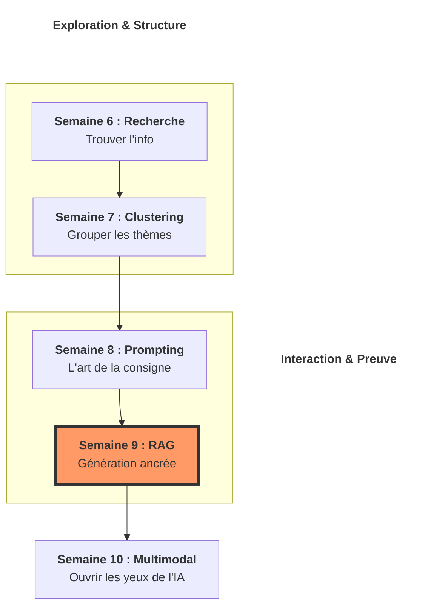

# 🧪 Chapitre 2 : Le Laboratoire des Usages

## Transformer la donnée en connaissance (Semaines 6 à 10)

Bonjour à toutes et à tous ! Quel plaisir de vous retrouver pour ouvrir ce deuxième grand volet de notre formation. Si le premier chapitre consistait à forger le moteur (l'architecture), ce deuxième chapitre nous emmène sur le terrain. 

> [!IMPORTANT]
‼️ **Je dois insister :** posséder un Transformer surpuissant est inutile si vous ne savez pas comment le faire dialoguer avec vos propres données. 

Dans ces cinq prochaines semaines, nous allons passer du statut de "mécanicien" à celui de "scientifique explorateur". Nous allons apprendre à cartographier des océans de texte, à murmurer aux oreilles des modèles pour en extraire le génie, et à leur donner des yeux pour percevoir notre monde. Bienvenue dans la science appliquée des LLM !

---
## 🗺️ Structure du Chapitre : De la donnée brute à la perception
Ce chapitre est conçu comme une montée en puissance de l'interaction entre l'IA et l'information réelle.

*   6️⃣ **Semaine 6 : L'Orientation (Recherche Sémantique)** – Nous apprenons à naviguer. Comment utiliser les vecteurs pour trouver une aiguille de sens dans une botte de foin de millions de documents.
*   7️⃣ **Semaine 7 : L'Organisation (Clustering)** – Nous apprenons à structurer. Comment laisser l'IA découvrir d'elle-même les thématiques qui se cachent dans vos archives non classées.
*   8️⃣ **Semaine 8 : Le Dialogue (Prompt Engineering)** – Nous apprenons à commander. C'est l'art de sculpter le contexte pour transformer une réponse banale en un raisonnement logique brillant.
*   9️⃣ **Semaine 9 : La Mémoire (RAG)** – Nous apprenons à ancrer. C'est la fusion entre la recherche et la génération pour que l'IA ne parle plus jamais de mémoire, mais toujours sur la base de preuves.
*   🔟 **Semaine 10 : La Perception (Multimodalité)** – Nous apprenons à voir. Nous brisons la prison du texte pour permettre à l'IA de comprendre et de décrire des images.

---
## 🛰️ Le Fil Conducteur : L'écosystème de l'intelligence

> [!NOTE]
✍🏻 **Notez bien cette synergie :** ce chapitre traite de l'IA "en contexte".

## 🔗 Les points de pivot
1.  **De la Semaine 6 à la 7** : La recherche sémantique nous donne la position des documents. Le clustering utilise ces positions pour dessiner une carte thématique. Sans le vecteur de la semaine 6, le groupe de la semaine 7 n'existerait pas.
2.  **De la Semaine 8 à la 9** : Le *Prompt Engineering* est l'outil qui permet de piloter le LLM. Le *RAG* injecte les résultats de recherche dans ce prompt. C'est le mariage de l'éloquence et de la documentation.
3.  **Vers la Semaine 10** : Tout ce que nous avons appris sur le texte (recherche, prompt, preuve) s'applique désormais aux images. C'est l'unification finale de la perception artificielle.

---
> [!IMPORTANT]
✉️ **Mon message** : Mes chers étudiants, ce chapitre est celui de la valeur ajoutée. C'est ici que vous apprendrez à résoudre des problèmes concrets d'entreprise. 

> [!WARNING]
⚠️ **Attention :** ne voyez pas le RAG ou le Multimodal comme des options "bonus". Dans le monde professionnel, ce sont eux qui font la différence entre un jouet technologique et un outil de production fiable. Soyez curieux, soyez rigoureux, et n'oubliez jamais que l'IA est un assistant que vous devez guider avec précision.