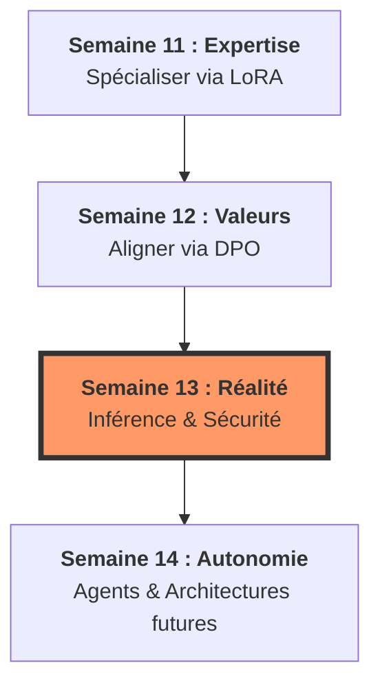

# 🏙️ Chapitre 3 : De la Forge à la Cité

## Maîtriser l'industrialisation et l'éthique (Semaines 11 à 14)

Bonjour à toutes et à tous ! Nous voici au seuil du troisième et dernier chapitre de notre grande épopée. Si le premier chapitre nous a appris à construire la machine et le second à la faire dialoguer avec le monde, ce troisième volet est celui de la maturité. 

> [!IMPORTANT]
‼️ **Je dois insister :** un modèle qui reste dans un notebook n'est qu'une curiosité scientifique. 

> Pour qu'il devienne un outil de production, il doit être sculpté par vos mains, éduqué selon nos valeurs et protégé contre la malveillance. 

Dans ces quatre dernières semaines, nous allons passer de "chercheurs" à "bâtisseurs de confiance". Bienvenue dans la forge de l'IA réelle !

---
## 🗺️ Structure du Chapitre : Le cycle de vie du produit
Ce chapitre est conçu comme une ligne de montage industrielle, où chaque étape ajoute une couche de fiabilité et de puissance.

*   1️⃣1️⃣ **Semaine 11 : La Chirurgie (Fine-tuning & LoRA)** – Nous apprenons à spécialiser. Comment injecter une expertise métier dans un modèle géant sans dépenser des millions d'euros, grâce à la magie de LoRA et de la quantification.
*   1️⃣2️⃣ **Semaine 12 : L'Éducation (Alignement & DPO)** – Nous apprenons à civiliser. C'est l'étape où nous donnons une boussole morale à l'IA pour qu'elle soit non seulement savante, mais aussi utile, honnête et inoffensive.
*   1️⃣3️⃣ **Semaine 13 : L'Armure (Déploiement & Sécurité)** – Nous apprenons à protéger. Nous transformons le modèle en un service foudroyant de rapidité (KV Cache) et blindé contre les attaques cybernétiques et les biais légaux.
*   1️⃣4️⃣ **Semaine 14 : L'Horizon (Synthèse & Futur)** – Nous apprenons à anticiper. Nous faisons la synthèse de nos trois piliers et nous regardons vers l'avenir : les agents autonomes et les architectures qui remplaceront bientôt les Transformers.

---

## 🛰️ Le Fil Conducteur : La chaîne de valeur

> [!IMPORTANT]
✍🏻 **Notez bien cette progression :** c'est le passage du "savoir-dire" au "savoir-être" en production.

## 🔗 Les points de fusion
1.  **De la Semaine 11 à la 12** : Le fine-tuning (SFT) crée un expert, mais un expert peut être arrogant ou dangereux. L'alignement de la semaine 12 est le filtre de politesse et de sécurité indispensable avant toute mise sur le marché.
2.  **De la Semaine 12 à la 13** : Une fois le modèle éduqué, il faut le rendre exploitable. L'ingénierie de la semaine 13 (quantification d'inférence) permet de faire tourner le cerveau "bien élevé" de la semaine 12 sur des serveurs économiques.
3.  **Vers la Semaine 14** : Nous bouclons la boucle. L'IA n'est plus un outil que l'on interroge, mais un agent qui agit. Tout ce que nous avons appris devient le "cerveau" d'une entité autonome.
