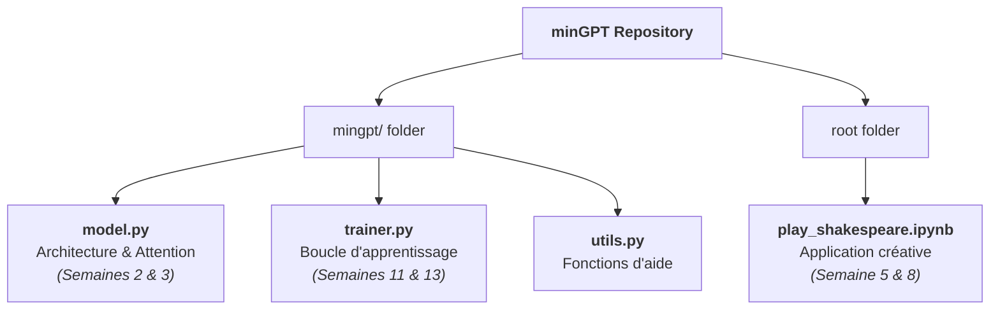

# Introduction : minGPT ou l'Épure du Génie

Bonjour à toutes et à tous ! Nous y sommes. C'est un moment d'émotion pour moi. Pendant quatorze semaines, nous avons manipulé des concepts qui semblaient parfois abstraits : l'attention, les gradients, les couches résiduelles. Aujourd'hui, je vais vous montrer que tout cela tient dans moins de 300 lignes de code. Nous allons étudier [**minGPT**](https://github.com/karpathy/minGPT), le projet d'Andrej Karpathy qui a fait tomber le mur de la complexité. 

> [!IMPORTANT]
**Je dois insister :** si vous savez lire ce code, vous savez lire l'esprit de n'importe quel LLM moderne. Ne voyez pas ce projet comme un jouet, voyez-le comme la "formule chimique" de l'intelligence artificielle.

---

## Pourquoi avoir choisi minGPT ?

Dans notre parcours, nous avons souvent utilisé des bibliothèques de haut niveau comme `transformers` de Hugging Face. C'est excellent pour la production, mais ces outils cachent souvent la mécanique sous des milliers de lignes de code de gestion d'erreurs. 

**minGPT** est l'exact opposé : c'est une implémentation "nue". Andrej Karpathy (fondateur d'OpenAI et ex-Directeur de l'IA chez Tesla) l'a écrit avec un seul objectif : **la clarté pédagogique**. 
*   **Minimalisme** : Tout est contenu dans un petit dossier `mingpt/`.
*   **Fidélité** : Il reproduit exactement l'architecture GPT-2/GPT-3 étudiée en **Semaine 5**.
*   **Transparence** : Chaque ligne de code correspond à une équation que nous avons vue en **Semaine 3**.

## Structure du Projet : La Carte du Labyrinthe

Le dépôt est organisé de manière à ce qu'un étudiant puisse le parcourir en moins d'une heure. Voici comment les fichiers s'alignent avec les piliers de notre cours :

1.  **`model.py`** : C'est le cœur du système. C'est ici que l'on trouve la définition des neurones, de la self-attention et de la structure du Transformer.
2.  **`trainer.py`** : C'est le moteur. Il gère l'optimisation, le calcul de la perte (loss) et la mise à jour des poids sur votre GPU T4.
3.  **Les scripts d'exemples** : Ils montrent comment "nourrir" ce cerveau avec du texte (Shakespeare, mathématiques) pour qu'il commence à générer du sens.

## L'Alignement avec notre cours
Tout au long de cette présentation, nous allons voir comment minGPT "donne vie" aux chapitres de notre livre de référence :
*   **La Géométrie (Fondements)** : Comment le code gère physiquement les matrices d'embeddings de la Section 2.4.
*   **La Dynamique (Science)** : Comment le mécanisme d'attention de la Section 3.1 est codé par une simple opération de multiplication matricielle (`@` en Python).
*   **La Rigueur (Ingénierie)** : Comment les techniques de régularisation et de normalisation de la Section 3.3 assurent que le modèle ne "devient pas fou" pendant l'entraînement.

> [!TIP]
**Mon message** : Préparez vos scalpels numériques. Dans la **Section 1**, nous allons disséquer le fichier `model.py`. Nous allons voir comment le texte devient un vecteur et comment l'attention crée des ponts sémantiques entre les mots. C'est l'étape la plus technique, mais aussi la plus gratifiante.

---

**Êtes-vous prêts à entrer dans le code source du miniGPT ?**