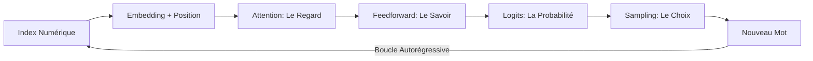

# Section 3 : Inférence et Créativité – Faire parler le modèle

Bonjour à toutes et à tous ! Nous y voilà. C'est un moment solennel et joyeux. Dans la Section 1, nous avons construit le corps de la machine. Dans la Section 2, nous lui avons appris à apprendre. Mais jusqu'à présent, notre modèle n'était qu'une statue savante, un amas de probabilités figées dans des fichiers de poids. Aujourd'hui, nous allons lui donner le souffle de la parole. 

> [!IMPORTANT]
**Je dois insister :** l'inférence est le moment où la mathématique devient littérature. Nous allons ouvrir la méthode `generate` de minGPT pour comprendre comment, à partir d'un simple chiffre, la machine parvient à tisser des phrases entières. Respirez, nous allons apprendre à murmurer à l'oreille du géant pour orienter sa créativité. Bienvenue dans l'art du décodage !

---

## 3.1 La Méthode `generate` : Le cœur battant de l'inférence

Dans les frameworks industriels, la génération est souvent cachée derrière des couches d'abstraction complexes. Dans minGPT, elle tient en une quinzaine de lignes dans le fichier `model.py`. C'est ici que vous comprendrez enfin la **nature autorégressive** des LLM que nous avons étudiée en Section 1.2 et 5.1.

### A. La boucle autorégressive (Analyse du code)
Regardez attentivement la structure de la fonction. C'est une boucle `for` qui s'exécute autant de fois que vous demandez de nouveaux tokens.

```python
# [SOURCE: karpathy/minGPT/mingpt/model.py#L210]
@torch.no_grad()
def generate(self, idx, max_new_tokens, temperature=1.0, do_sample=False, top_k=None):
    for _ in range(max_new_tokens):
        # 1. On tronque le contexte si nécessaire
        idx_cond = idx if idx.size(1) <= self.config.block_size else idx[:, -self.config.block_size:]
        # 2. Forward pass pour obtenir les logits
        logits, _ = self(idx_cond)
        # 3. Focus sur le dernier token (Section 3.4)
        logits = logits[:, -1, :] / temperature
        # ... (Suite du traitement)
```

**L'intuition de l'expert** : Remarquez le décorateur `@torch.no_grad()`. 

> [!WARNING]
**Attention : erreur fréquente ici !** Lors de l'inférence, on ne veut surtout pas que PyTorch calcule les gradients. Pourquoi ? Parce que nous ne sommes plus en train d'apprendre. Si vous oubliez cela, votre GPU T4 sera saturé par des calculs inutiles et votre chatbot sera désespérément lent.

---

## 3.2 La transformation des Logits : Le thermostat de la pensée

C'est ici que nous appliquons les concepts de la Section 5.3 sur les paramètres de génération.

### A. La Température : Sculpter la cloche de Gauss
Dans le code, vous voyez : `logits = logits[:, -1, :] / temperature`. 

**Je dois insister sur cette division :** 
*   **Si Température < 1.0** : On divise par un petit nombre. Les grands scores deviennent géants, les petits s'effacent. Le modèle devient "froid" et déterministe.
*   **Si Température > 1.0** : On divise par un grand nombre. On "aplatit" la distribution. Le modèle devient "chaud" et aventureux.

Comme nous l'illustre la [**Figure 5-7**](#fig-5-7) , la température ne change pas l'ordre des mots préférés, elle change leur **domination relative**.

### B. Le filtrage Top-K : L'élagage du hasard
Pour éviter que le modèle ne choisisse un mot totalement absurde par pur hasard, Karpathy implémente un filtre de sécurité :

```python
if top_k is not None:
    v, _ = torch.topk(logits, min(top_k, logits.size(-1)))
    logits[logits < v[:, [-1]]] = -float('Inf')
```

**Analyse technique** : On ne garde que les **K** meilleurs candidats. Tous les autres sont envoyés à "moins l'infini" ($-\infty$). 

> [!NOTE]
**Note** : C'est ce que nous avons vu en Section 5.3 : le Top-K empêche le modèle de s'égarer dans la "longue traîne" des mots improbables. Même si le modèle est créatif, il reste dans un périmètre de mots qui ont du sens.


---

## 3.3 Sampling vs Greedy : Mathématique ou Intuition ?

Une fois que les probabilités sont calculées via le `softmax`, il faut trancher. minGPT propose deux philosophies de vie :

1.  **Greedy Decoding (Désactivé par défaut)** : Si `do_sample=False`, on utilise `torch.topk(logits, k=1)`. On prend le n°1, point final. C'est l'IA "comptable", sans aucune surprise.
2.  **Multinomial Sampling** : Si `do_sample=True`, on utilise `torch.multinomial(probs, num_samples=1)`. On tire au sort. 

**Mon analogie** : Imaginez un poète. Le mode Greedy, c'est le poète qui utilise toujours le mot le plus banal. Le mode Sampling, c'est le poète qui accepte de prendre un risque sémantique pour créer une image nouvelle. C'est ce qui donne aux LLM leur aspect "humain".

---

## 3.4 Le Paradoxe du KV Cache dans minGPT

Mes chers étudiants, soyez très attentifs à ce qui **manque** dans ce code.
Si vous relisez la **Section 3.4** (Semaine 3) et la **Section 13.1** (Semaine 13), nous avons parlé du **KV Cache** pour accélérer la génération.

Dans minGPT, Karpathy a fait un choix pédagogique fort : **il n'y a pas de KV Cache.**
*   **Pourquoi ?** Pour que le code reste "min" (minimaliste). Ajouter un cache rendrait la classe `CausalSelfAttention` trois fois plus longue et beaucoup plus difficile à lire.
*   **Conséquence technique** : À chaque nouveau mot, minGPT recalcule l'attention pour TOUT le passé. C'est une complexité $O(L^2)$. 

> [!IMPORTANT]
Pour un petit projet comme `play_char.py` avec Shakespeare, ce n'est pas grave. Mais si vous déployez minGPT en production pour 1000 utilisateurs, vos serveurs vont brûler. 

**La leçon à retenir :** minGPT est un moteur de compréhension, pas un moteur de production.

---

## 3.5 Démonstration pratique : Shakespeare sur un GPU T4

Comment utilise-t-on concrètement ce projet ? Karpathy propose un exemple fascinant : entraîner un modèle à prédire le caractère suivant (et non le mot suivant) sur l'œuvre complète de Shakespeare.

Regardons la structure du script d'entraînement :

```python
# [SOURCE: karpathy/minGPT/projects/chargpt/chargpt.py]
# Configuration d'un mini-modèle pour Colab
mconf = GPTConfig(vocab_size=train_dataset.vocab_size, block_size=128, n_layer=6, n_head=8, n_embd=512)
model = GPT(mconf)
```

 
Nous sommes ici dans la phase de **Pre-training** (Semaine 1.4). Le modèle ne sait pas qu'il s'agit de théâtre. Il apprend simplement que statistiquement, après les lettres `T-o- -b-e- -o-r- -n-o-t- -t-o-`, la lettre la plus probable est ` -b-e`.


**Le résultat** : Après quelques heures sur un GPU T4, le modèle commence à inventer des noms de personnages et des structures de dialogues qui ressemblent à du vieux anglais. C'est l'éveil de la capacité de généralisation (Section 5.1).

---

## 3.6 Éthique et Limites de la Voix Numérique

> [!CAUTION]
Mes chers étudiants, quand minGPT commence à parler, il ne sait pas ce qu'il dit. 

1.  **Hallucinations de style** : minGPT est un champion de l'imitation. S'il a été entraîné sur Shakespeare, il sera très convaincant... même s'il invente des faits historiques faux au milieu d'un sonnet. **Ne confondez pas la forme (la fluidité) et le fond (la vérité).**

2.  **Biais de caractères** : En travaillant au niveau du caractère, le modèle est très sensible aux fautes d'orthographe ou aux biais typographiques de ses données d'entraînement. 

3.  **Absence de filtre** : minGPT n'a pas de couche d'alignement (RLHF/DPO, Semaine 12). Il est "brut". Si vos données d'entraînement contiennent des propos haineux, minGPT les reproduira avec une fidélité mathématique totale. **La responsabilité de l'ingénieur est de filtrer les données AVANT qu'elles n'entrent dans le `Trainer`.**

---

### Synthèse Finale du Projet

Nous avons terminé notre dissection. Vous avez vu comment les tokens deviennent des vecteurs (Section 1), comment l'erreur corrige les neurones (Section 2) et comment le hasard dirigé crée la parole (Section 3).



> [!TIP]
**Le message final** : minGPT est la preuve que la complexité n'est pas une fatalité. En tant qu'architectes, votre but est de toujours revenir à cette simplicité. Si vous comprenez le `for token in range(max_new_tokens):`, vous n'aurez plus jamais peur d'un modèle de 100 milliards de paramètres. Ils ne sont que des minGPT avec plus de muscles.

---

Préparez-vous pour notre second projet : **Second Brain AI-Assistant**. Nous allons passer du "moteur" à la "voiture complète" : comment intégrer ce cerveau dans un système de mémoire réelle (RAG) et d'outils. Le voyage continue !
