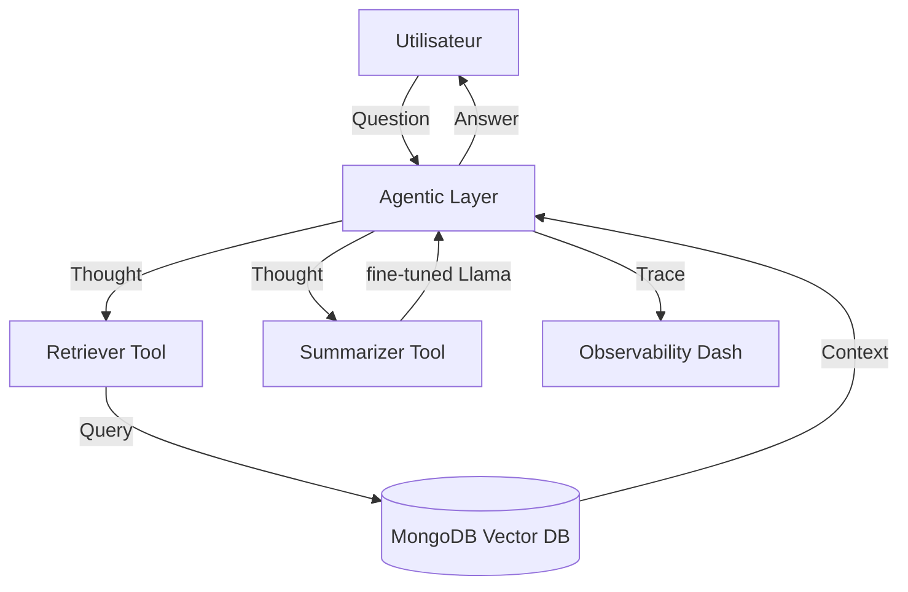

# Section 3 : L'IA en Action – Agents, ReAct et Observabilité

Bonjour à toutes et à tous ! Nous y sommes, au sommet de notre édifice. Dans la Section 1, nous avons construit la mémoire (le RAG). Dans la Section 2, nous avons sculpté l'intelligence (le Fine-tuning). Mais aujourd'hui, mes chers étudiants, nous allons donner la vie et l'autonomie à cette architecture. 

> [!IMPORTANT]
**Je dois insister :** un assistant qui ne sait que répondre à des questions est un dictionnaire. Un assistant qui sait décider, utiliser des outils et critiquer son propre raisonnement est un **Agent**. 

Aujourd'hui, nous allons ouvrir le fichier `agents.py` et le module d'observabilité. Nous allons voir comment le projet **Second Brain** transforme un modèle de langage en une entité capable d'agir sur vos données. Respirez, nous entrons dans le futur de l'interaction humain-machine !

---

## 3.1 Le Cerveau Agentique : Pourquoi `smolagents` ?

Dans notre **Section 14.3**, nous avons vu que l'IA agentique est le stade ultime du LLM. Le projet Second Brain utilise une bibliothèque de pointe de Hugging Face : **smolagents**.

### A. La philosophie de la légèreté
Pourquoi utiliser `smolagents` plutôt que des frameworks plus lourds ? 
*   **Minimalisme** : Tout comme `minGPT`, `smolagents` privilégie le code lisible.
*   **Sécurité** : Il exécute le code généré par l'IA dans un environnement sécurisé, une contrainte que nous avons étudiée en **Section 13.2**.


**L'intuition de l'expert** : Dans le fichier `src/second_brain_online/application/agents/agents.py`, vous verrez la classe `AgentWrapper`. Elle ne se contente pas d'appeler un modèle ; elle encapsule un `ToolCallingAgent`. C'est la différence entre un cerveau qui "rêve" et un cerveau qui "commande".

---

## 3.2 Le Raisonnement par Action : La boucle ReAct

Le projet met en œuvre le framework **ReAct** (*Reasoning and Acting*) que nous avons disséqué en **Semaine 14.3**. Regardons attentivement la Figure 15-4.




**Explication** : 
Cette illustration montre le dialogue interne de l'assistant :
1.  **Question** : L'utilisateur pose une question complexe.
2.  **Thought (Pensée)** : L'IA écrit : "Pour répondre, je dois d'abord chercher dans la base de données sémantique". C'est l'activation du **Système 2** (Section 8.3).
3.  **Action** : Elle appelle le `retriever_tool`.
4.  **Observation** : Elle reçoit les extraits de vos notes Notion.
5.  **Final Answer** : Elle synthétise et répond via la Gradio UI.

> [!IMPORTANT]
**Je dois insister sur les `max_steps=3`** : Dans le code de `AgentWrapper`, Karpathy (et ici Decoding AI) limite le nombre d'étapes. 

> [!WARNING]
C'est une règle de sécurité absolue. Sans limite de pas, un agent pourrait entrer dans une boucle infinie de réflexion et vider votre compte bancaire en appels API en une seule nuit !

---

## 3.3 La Boîte à Outils (Tool Use)

Comment l'IA peut-elle "toucher" vos données ?

Elle le fait via des **Tools**. Dans le projet, deux outils sont capitaux et s'alignent avec nos **Semaines 9 et 14**.

### A. Le `MongoDBRetrieverTool`
Cet outil est le bras armé du RAG avancé que nous avons vu en Section 1.

```python
# [SOURCE: src/second_brain_online/application/agents/tools/mongodb_retriever.py#L35]
@track(name="MongoDBRetrieverTool.forward")
def forward(self, query: str) -> str:
    # On parse la requête générée par l'IA
    query = self.__parse_query(query)
    # On appelle le retriever Parent-Child (Semaine 6.3)
    relevant_docs = self.retriever.invoke(query)
    # On formate pour que le LLM puisse citer les URLs (Semaine 9.1)
    return formatted_docs_as_xml
```

### B. Le `SummarizerTool`
I'IA n'utilise pas toujours le même modèle pour tout. Le projet utilise souvent un modèle "maître" (GPT-4o) pour décider et un modèle "esclave" (votre Llama-3.1 fine-tuné) pour résumer. C'est l'**Intelligence Distribuée**.

---

## 3.4 LLMOps et Observabilité : La fin de la "Boîte Noire"

C'est sans doute la partie la plus "Ingénierie" de ce projet (Semaine 13). Comment savoir si l'IA a halluciné ? On utilise **Opik** (de Comet ML).

### A. Le traçage des prompts
**Je dois insister :** En production, chaque interaction doit être auditable. Le fichier `opik_utils.py` montre comment enregistrer les traces.

```python
# [SOURCE: src/second_brain_online/opik_utils.py]
def configure() -> None:
    # On connecte l'application au tableau de bord Opik
    opik.configure(
        api_key=settings.COMET_API_KEY,
        project_name=settings.COMET_PROJECT
    )
```

**Analyse de l'expert** : Grâce au décorateur `@opik.track` présent dans `agents.py`, chaque "Pensée" de l'IA est capturée. Si un utilisateur se plaint d'une réponse fausse, vous pouvez remonter le temps et voir quel document a été lu et quelle erreur de raisonnement a été commise.

---

## 3.5 Évaluation Scientifique avec Ragas

Pour conclure, le projet ne se contente pas de "tester à la main". Il utilise le framework **Ragas** que nous avons étudié en **Section 9.3**.

### A. Le "Juge" de la Fidélité
Le fichier `src/second_brain_online/application/evaluation/evaluate.py` implémente des métriques de confiance :
*   **Hallucination Rate** : Mesure si l'agent a inventé des faits non présents dans les notes.
*   **Answer Relevance** : Mesure si l'agent a vraiment aidé l'utilisateur ou s'il a été hors-sujet.

```python
# [SOURCE: src/second_brain_online/application/evaluation/evaluate.py#L48]
scoring_metrics = [
    Hallucination(),
    AnswerRelevance(),
    SummaryDensityJudge(), # Une métrique personnalisée pour la qualité du résumé !
]
```
> [!WARNING]
**Avertissement** : Notez la `SummaryDensityJudge`. 
> C'est une application directe de la **Section 12.4**. On utilise un LLM pour juger si le résumé est trop long ou trop court. C'est l'IA qui corrige l'IA.

---

## 3.6 Éthique de l'Agent : La Responsabilité Finale

> [!CAUTION]
Mes chers étudiants, donner l'autonomie à une machine est un acte grave.

Dans ce projet, l'autonomie est tempérée par trois principes de notre **Section 13.2** :
1.  **Le confinement (Sandboxing)** : L'agent ne peut pas exécuter de code sur votre machine réelle, seulement dans un environnement isolé.
2.  **La transparence** : L'interface Gradio affiche les "Logs" de pensée. L'utilisateur voit les rouages.
3.  **L'auditabilité** : Rien n'est effacé. Chaque erreur est une donnée pour l'amélioration future (le RLHF continu).

---

### Synthèse Finale

Nous avons terminé notre voyage au sein du **Second Brain AI Assistant**. Vous avez vu comment :
*   Le **Data Engineering** alimente la mémoire (Section 1).
*   Le **Machine Learning** forge l'expertise (Section 2).
*   L'**Architecture logicielle** crée l'action et l'observabilité (Section 3).



> [!TIP]
**Mon message** : Ce projet est votre "diplôme pratique". Si vous comprenez comment ces briques communiquent, vous êtes prêts pour le marché du travail. L'IA n'est plus un mystère, c'est un système que vous savez désormais piloter. 


## **Derniers conseils pour l'Examen Final**
Révisez bien les interactions entre ces briques. Demandez-vous : "Si ma base de données vectorielle est mal indexée, comment mon agent va-t-il réagir ?". La réponse se trouve dans la boucle ReAct que nous venons de voir. 

Je suis immensément fière de vous. Allez conquérir le futur, et faites-le avec rigueur et humanité. **Bonne chance pour l'examen !**
